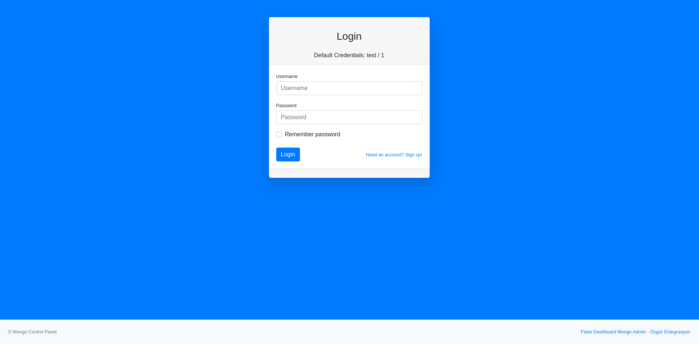
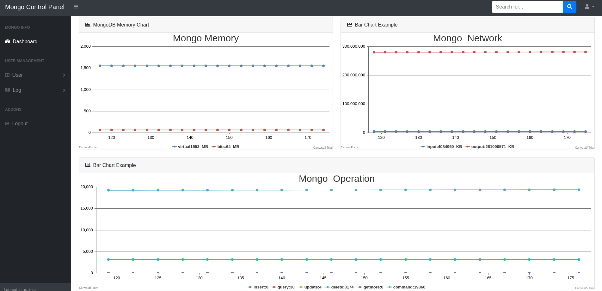
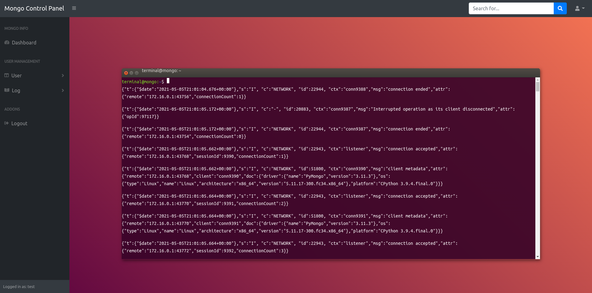
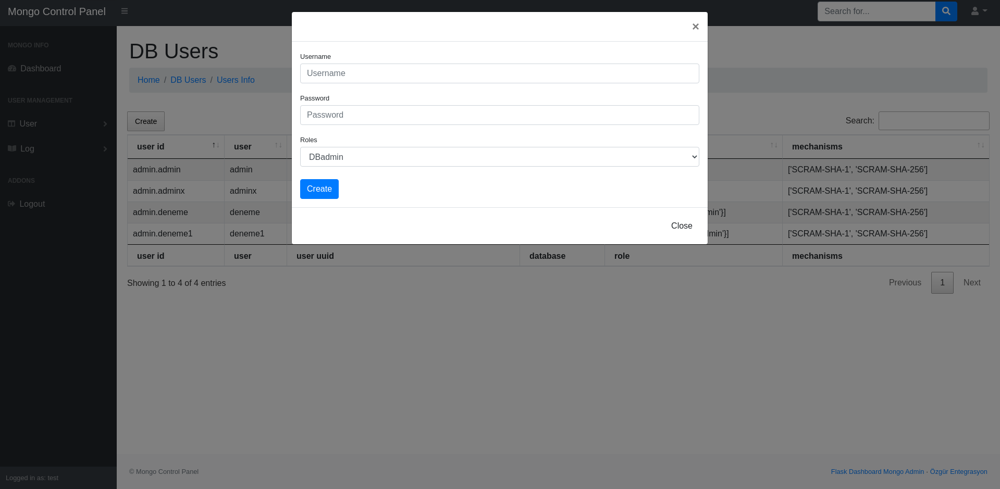

# MongoDB-ControlPanel
## Mongodb Monitoring and Managing Software

PyMongo kütüphanesi ve flask çatısı ve websocket kullanarak oluşturulmuş bir kontrol panel.

### Yetenekleri


* MongoDb nin network, memory, operationlarını anlık olarak izler ve canvasjs yardımıyla grafiğe döker.
* Kullanıcı oluşturur.
* Connection listesini tablo şeklinde sunar. 
* Document ve collectionları görüntüler. 
* Collectionları siler. 
* Global ve setwarning Loglarını websocket yardımıyla görüntüler.

### Kurulum

```sh
pip3 install -r requirements.txt
```

Init Dosyası Düzenleyin

```
mongo_client = MongoClient('mongodb://xxx.xx.x.xx:27017/')

```

Gerekli düzenlemeleri yaptıktan sonra projeyi çalıştırın

```sh
python3 run.py
```


###  Giriş Ekranı


###  Monitor Ekranı


###  Log Ekranı


### Kullanıcı Ekleme Ekranı



